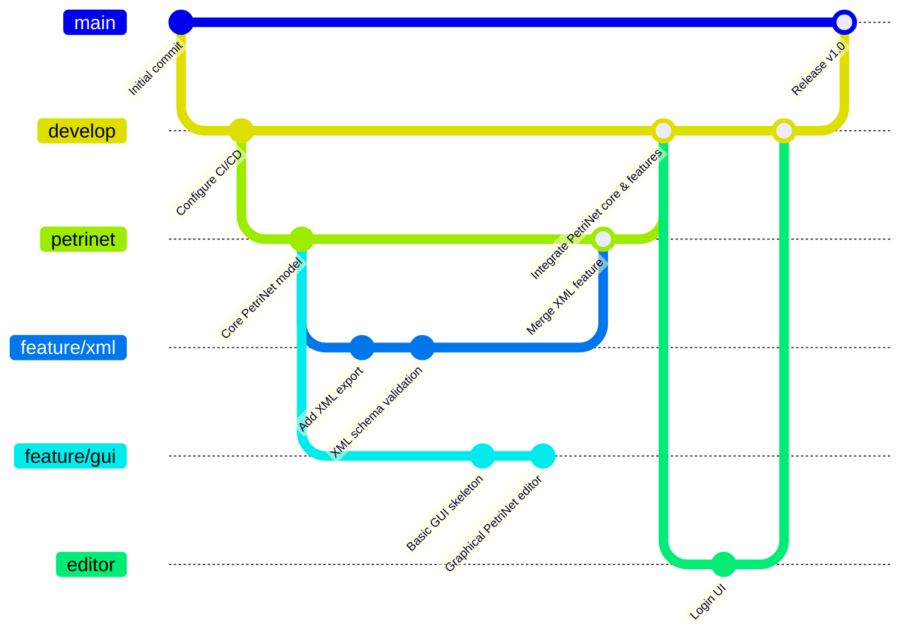

# Petri-Net project

## Project structure

__________

## Project description

This project is a Petri-Net simulator and editor. It allows users to create, edit, and simulate Petri-Nets using a graphical user interface (GUI). The project is built using Python and includes features for XML export and schema validation.
