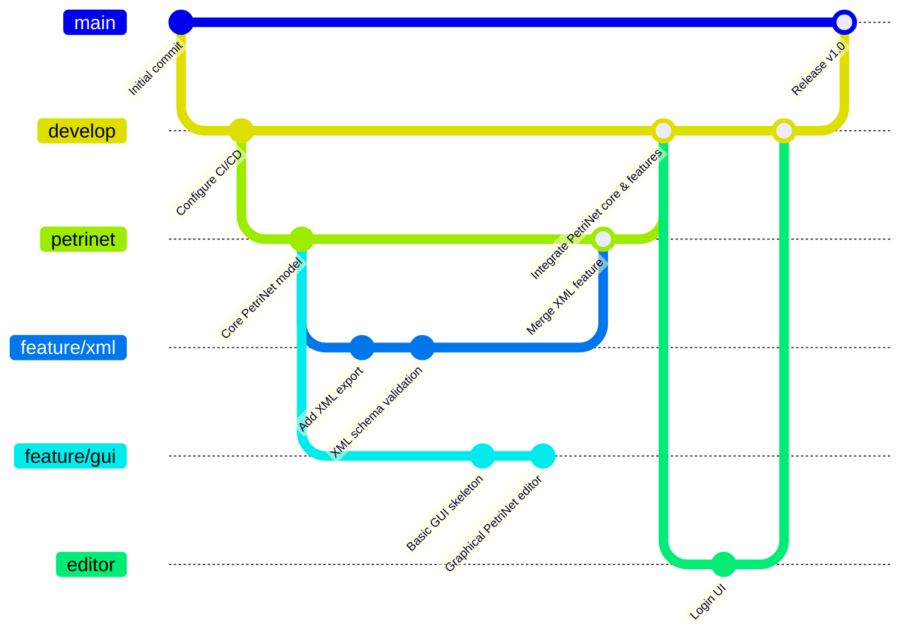
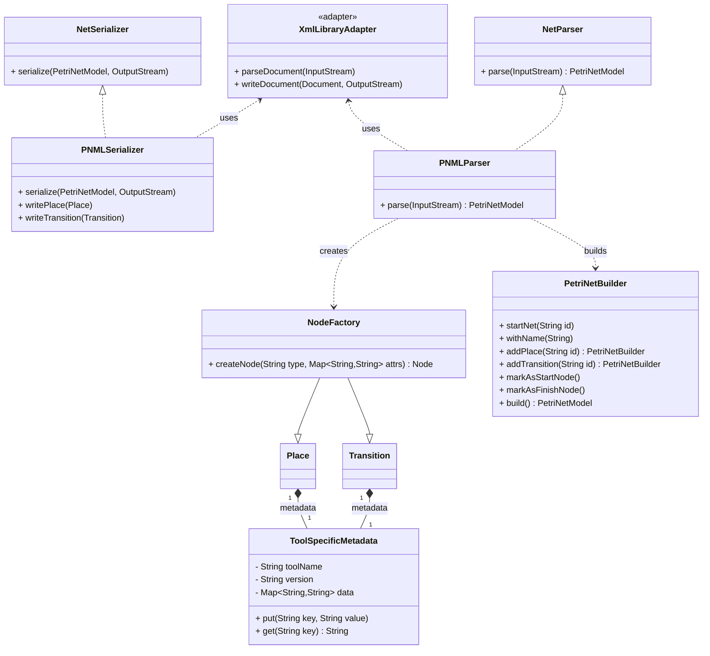

# Petri-Net project

<!--toc:start-->

- [Petri-Net project](#petri-net-project)
  - [Project structure](#project-structure)
  - [Project description](#project-description)
  - [PNML](#pnml)
  <!--toc:end-->

## Project structure

---

## Project description

This project is a Petri-Net simulator and editor. It allows users to create, edit, and simulate Petri-Nets using a graphical user interface (GUI). The project is built using Python and includes features for XML export and schema validation.

## PNML

PNML (Petri Net Markup Language) is an XML-based format for representing Petri nets. It provides a standardized way to describe the structure and behavior of Petri nets, making it easier to share and exchange Petri net models between different tools and applications.

