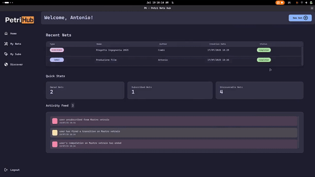

# PetriNet Hub
> Final project for my Software Engineering course @ UniVR &mdash; A.Y. 2024/2025. The complete documentation, including class and sequence diagram, (written in Italian) can be found [here](https://github.com/alessio-vivaldelli/PetriHub/Relazione-PetriHub.pdf).
## Description

**PetriNet Hub** is a comprehensive desktop application developed in Java for the design, visualization, and simulation of Petri nets, following the formalisms of the **ISO/IEC 15909-2** standard to save and load them.

The application is built with a clean, modern user interface and a robust backend, allowing users to manage their own library of Petri nets, interact with nets created by others, and simulate their behavior step-by-step.

### Key Features

* **User and Session Management**: A complete login and registration system to manage user access. The application supports two distinct roles: **standard users** and **administrators**, with administrators having elevated privileges to create new nets and fire admin transition.
* **Interactive Petri Net Editor**: A graphical editor that allows users to:
    * Create, position, and label **places** and **transitions**.
    * Draw **arcs** to connect nodes, with built-in validation to enforce Petri net rules (e.g., preventing place-to-place connections).
    * Designate special nodes, such as **start** and **end** places and changing transition type between **user** and **admin**.
* **Visual Simulator**: A viewer mode where users can subscribe to a Petri net and simulate its execution by firing transition (which has user type). The visualizer graphically indicates which transitions are "firable" and updates the token count in each place as transitions are fired.
* **PNML-Standard Persistence**: Petri nets are saved and loaded using the **PNML (Petri Net Markup Language)** (ISO/IEC 15909 Part 2) format. The system also extends the standard to save custom application-specific data, such as the type of transition (e.g., `USER` or `ADMIN`).
* **Centralized Dashboard**: Upon logging in, users are greeted with a dashboard that provides a clear overview of their recently modified nets, subscribed nets, and other nets available to discover on the platform and also view notifications inbox.
* **Database Backend**: All user data, net metadata, and simulation states are persisted in a local **SQLite** database, making the application self-contained and easy to run.

---

---

### Application in Action

A quick look at some of the core functionalities of the PetriNet Hub.

**1. Interactive Net Building**

The graphical editor provides a seamless experience for designing Petri nets from scratch. Admin can place nodes, connect them with arcs, and configure their properties.



---

**2. Collaborative Simulation**

The application supports complex, multi-role simulations. This demo illustrates a collaborative workflow where a standard user initiates a process that can only be completed by an administrator.

1.  A **user** discovers a new net and starts a computation.
2.  They execute all the transitions available to them (i.e., those with `USER` privileges).
3.  An **administrator** then accesses the same computation, fires the restricted transitions (`ADMIN` privileges), and successfully brings the net to its final state.

This feature highlights how the system can model workflows that require different levels of authorization to be completed.


## Dependencies

This project is managed by **Apache Maven**. All dependencies are listed in the `pom.xml` file. The primary technologies used are:

* **JavaFX**: For the entire Graphical User Interface (GUI).
* [**JavaFXSmartGraph**](https://github.com/brunomnsilva/JavaFXSmartGraph): A third-party library used as a foundation for graph visualization. This library was integrated locally and **modified** to support custom node shapes, advanced event handling, and direct rendering of domain-specific objects (`Place`, `Transition`).
* **JUnit 5**: For the comprehensive suite of unit tests.
* **SQLite-JDBC**: The driver used for database connectivity.

---

## Installation

To get the application running on your local machine, please follow these steps.

### Prerequisites

* **JDK 17** or higher.
* **Maven**.

### Running the Application

1.  **Clone the repository:**
    ```sh
    git clone https://github.com/alessio-vivaldelli/PetriHub
    cd PetriHub
    ```

2.  **Build and Run with Maven:**
    The project uses the `javafx-maven-plugin`, so you can compile and run the application with a single command.
    ```sh
    mvn clean javafx:run
    ```
    This will launch the application, starting with the login screen.

### Running Tests

The project includes a suite of unit tests to ensure the core logic is working correctly. To run these tests, execute the following Maven command:
```sh
mvn test
```